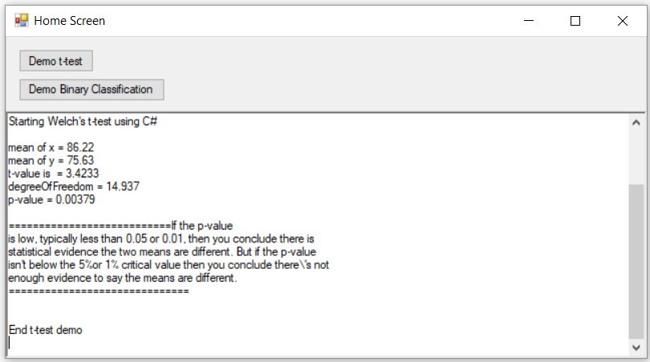

# Introduction
Implementation of *Welch's t-test* and *Binary Classification Optimisation*

# Description

The two buttons in the home screen do the below functions. Also, the result and inputs are shown in the text area. 

**1. Welch's t-test**: Calculates *Welch's t-test* according to algorithm available online. Source code is in *Stat\TTest.cs*. Takes two *double* arrays and performs *t-test*.

**2. Binary Classification Optimisation**: Source code is in *DataMining\BasicDBMining.cs*. The input has three parameters - one *double* array, one *int* array and a *stepSize* variable (*Double*). The first parameter (double array) is the calculated score array. If there are *n* observations, the double array will have *n* calculated scores for each of them. The second parameter, i.e., int array is the actual classification for each of the observations in order. It is represented as *1* (for true) and *0* (for false). The algorithm tries to find an optimum threshold score to partition the calculated scores into true or false. Calculated score (from first parameter - double array) below the threshold score is considered false and calculated score above or equal to the threshold score is considered true. The calculated true/false score is compared with actual true/false score and accuracy is calculated. The algorithm initially assigns threshold score as the minimum of calculated score and iteratively increases it to the maximum, each time by the *step size* (the third parameter). In each iteration, accuracy is calculated. The threshold score that gave the most accuracy is the output of the algorithm.

# How to run
The executible is *HomeMenu\bin\Debug\HomeMenu.exe*. From *Windows* environment, double click on the *.exe* file to run it. Alternately, build the solution (*HomeMenu.sln*) from Visual Studio and run.

# Project information
**Author:** Dr Arif Khan 
**Supervisor:** Dr Shahadat Uddin, Dr Uma Srinivasan 
**Language:** C# 
**Built Year:** March 2016 
**IDE:** Visual Studio 
**License:** MIT

# Screenshot

